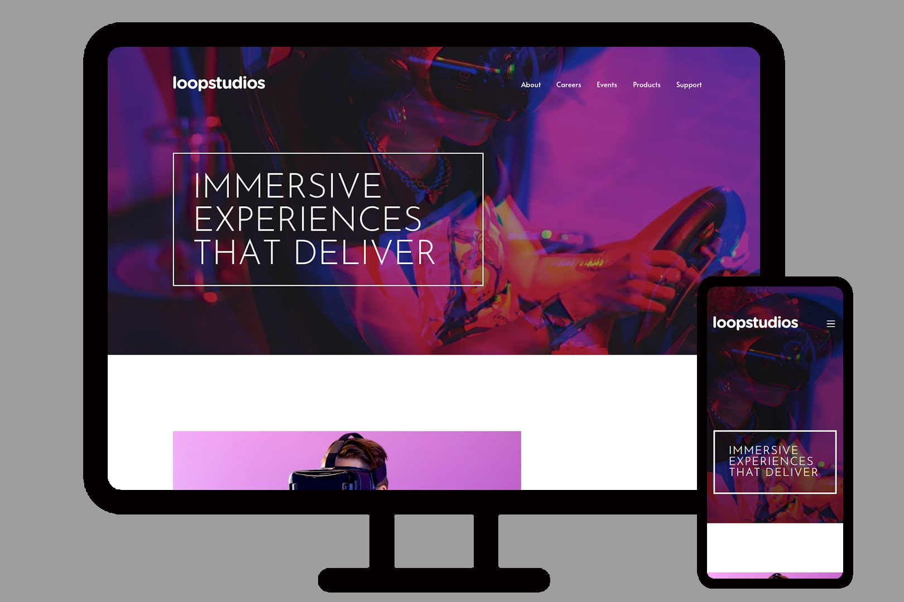

# Frontend Mentor - Loopstudios Landing page

[Frontend Mentor](https://www.frontendmentor.io) challenges help you improve your coding skills by building realistic projects.

This was a great challenge, it was difficult, but I could made almost perfect like the project of this challenge. I apreciatte the frontend mentor, because was there that I found it.

### Links

- Solution URL: [Solution](https://mthsimao.github.io/junior-landingpage/)

### 🔨 Tools

- [FlexBox](https://css-tricks.com/snippets/css/a-guide-to-flexbox/)
- [Grid Layout](https://developer.mozilla.org/pt-BR/docs/Web/CSS/CSS_grid_layout/Basic_concepts_of_grid_layout)
- [JavaScript](https://developer.mozilla.org/pt-BR/docs/Web/JavaScript)
- [Bootstrap](https://getbootstrap.com)

## Author

- My portfolio - <a href="https://matsimao.vercel.app" target="_blank">Matheus Simão</a>
- Frontend Mentor - <a href="https://www.frontendmentor.io/profile/mthsimao" target="_blank"> mthsimao</a>
